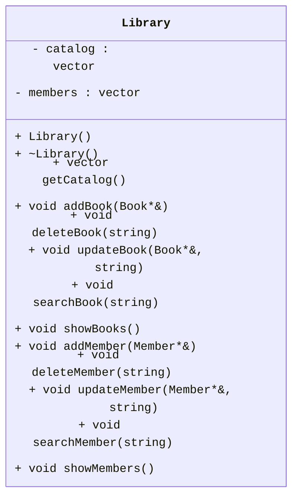
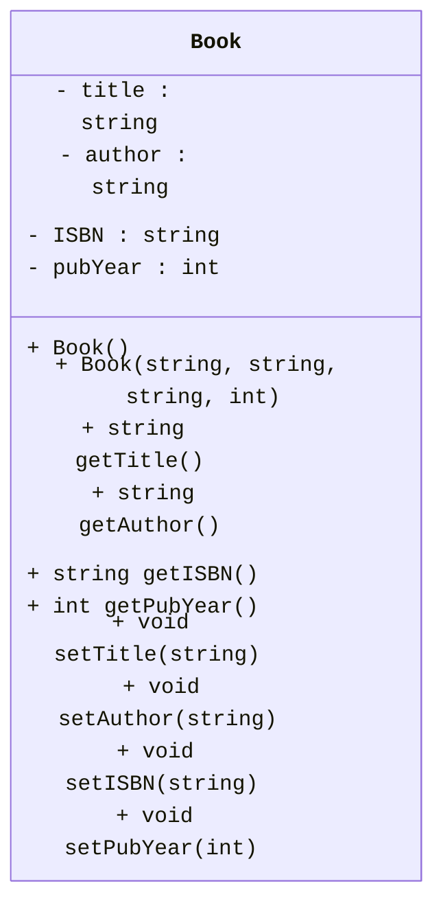

# System for Library Management

## Compilation and Execution Instructions:
Compilation will take place in the root directory, which contains both the `src` and `data` folders. `main.cpp` is used for execution. **Copy and paste for compiling:**
```cpp
g++ .\src\Library.cpp .\src\Book.cpp .\src\main.cpp .\src\Member.cpp .\src\Adult.cpp .\src\Child.cpp
```

<div>
   <h1>Manual</h1>
   <h3>Description</h3>
   <p>The Library Management System handles library operations, including borrowing, returning, and tracking books. Additionally, it features an organized structure to handle book management in the library and also supports adding and removing members.</p>
   <h3>How It Works</h3>
   <ul>
      <li>Users interact with the system using a command-line interface. This is done by using the <code>main.cpp</code> file. </li>
      <li>Implementations include: Borrowing books, returning books, tracking books, adding books, removing books, searching books, adding members, removing members, and updating the book catalog.</li>
   </ul>
   <h3>Code Design</h3>
   <p>This project was founded on Object-Oriented Programming principles using C++ to manage the backend tasks of a library system, as well as the processing of user interaction.</p>
   <p>Features of the design includes:</p>
   <ul>
      <li><strong>Object-Oriented Design:</strong> The utilization of classes to represent different entities in a library.</li>
      <li><strong>Dynamic Memory:</strong> The use of dynamic memory allocation to manage collections of objects, in this case, books and members.</li>
      <li><strong>Inheritance and Polymorphism:</strong> A design with base and derived classes, while polymorphism allows for dynamic method binding.</li>
      <li><strong>Encapsulation and Abstraction:</strong> Classes hide implementation details while providing clear interfaces.</li>
      <li><strong>Efficient Containers:</strong> C++ Standard Library containers like vectors are used to manage collections.</li>
      <li><strong>Error Handling:</strong> The program manages invalid inputs and unexpected conditions.</li>
   </ul>
   <p>By implementing these coding principles, this project delivers a user-friendly experience, ensuring ease of access while providing an efficient structure.</p>
</div>

# Class Information

1. The `Library` class
   - **Member Variables**
     - a `vector` that holds a pointer to a `Book` object - **`catalog`**
     - a `vector` that holds a pointer to a `Member` object - **`members`**
   - **Constructors**
     - a default constructor that takes no parameters.
     - a destructor that takes no parameters.
   - **Member Functions/Methods**
     - <i>Getters</i>
       - `void getCatalog()`: returns book catalog as vector
     - **Functions for Book Catalog**
       - `void addBook(Book*&)`: adds pointer to `Book` object to **`catalog`** vector
       - `void deleteBook(string)`: deletes a pointer of `Book` from vector **`catalog`** based on string title
       - `void updateBook(Book*&, string)`: updates pointer to `Book` object with new `Book` object based on if title matches
       - `void searchBook(string)`: searches in vector for pointer to `Book` object by `string` title
       - `void showBooks()`: shows all Books in vector
      - **Functions for Member List**
        - `void addMember(Member*&)`: adds pointer to `Member` object to **`members`** vector
        - `void deleteMember(string)`: deletes a pointer of `Member` from vector **`members`** based on string name
        - `void updateMember(Member*&, string)`: updates pointer to **`Member`** object with new **`Member`** object based on if name matches
        - `void searchMember(string)`: searches in vector for pointer to `Member` object by string name
        - `void showMembers()`: shows all Members in vector: **`members`**
2. The `Book` class:
   - **Member Variables**
     - a `string` that holds title of a book - **`title`**
     - a `string` that holds author of a book - **`author`**
     - a `string` that holds ISBN of a book - **`ISBN`**
     - an `int` that holds publication year of a book - **`pubYear`**
   - **Constructors**
     - a default constructor that takes no parameters.
     - a fully parameterized constructor that takes all member variables.
   - **Member Functions/Methods**
     - <i>Getters</i>
       - `string getTitle() const`: returns title
       - `string getAuthor() const`: returns author
       - `string getISBN() const`: returns ISBN
       - `int getPubYear() const`: returns publication year
     - <i>Setters</i>
       - `void setTitle(string)`: sets title
       - `void setAuthor(string)`: sets author
       - `void setISBN(string)`: sets ISBN
       - `void setPubYear(int)`: sets publication year
3. The `Member` class:
   - **Member Variables**
     - a `string` that holds member name - **`name`**
     - an `int` that holds member age - **`age`**
     - an `int` that holds a member's card number - **`cardNumber`**
     - an `int` that holds the member's potential late fees - **`lateFees`**
     - a `vector` that holds a pointer to a `Book` object - **`booksBorrowed`**
   - **Constructors**
     - a default constructor that takes no parameters.
     - a parameterized constructor that takes values **`name`**, **`age`**, and **`cardNumber`**.
   - **Member Functions/Methods**
     - <i>Getters</i>
       - `string getName() const`: returns name
       - `int getAge() const`: returns age
       - `int getCardNumber() const`: returns card number
       - `int getLateFees() const`: returns potential late fees cost
     - <i>Setters</i>
       - `void setName(string)`: sets name
       - `void setAge(int)`: sets age
       - `void setCardNumber(int)`: sets card number
    -  **Functions**
       - `void borrowBook(string, Library&)`: adds `Book` from `Library` catalog to **`booksBorrowed`** vector based on title
       - `void returnBook(string)`: deletes a pointer of **`Book`** from `vector` based on string title
       - `void viewBorrowed()`: shows all `Book`s borrowed from vector **`booksBorrowed`**
       - `virtual void sectionAccess() = 0`: pure virtual function for derived classes, determines member's access to sections
4. The `Child` class:
   - **Constructors**
     - a default constructor that takes no parameters.
     - a parameterized constructor that takes values **`name`**, **`age`**, and **`cardNumber`**
    -  **Functions**
       - `virtual void sectionAccess()`: virtual void function that determines section access of library, there's IS NOT full access because this is a Child class

5. The `Adult` class:
   - **Constructors**
     - a default constructor that takes no parameters.
     - a parameterized constructor that takes values **`name`**, **`age`**, and **`cardNumber`**
    -  **Functions**
       - `virtual void sectionAccess()`: virtual void function that determines section access of library, there's full access because this is an Adult class

<br></br>

### Below is the **UML** representation of the class `Library`.



### Below is the **UML** representation of the class `Book`.



### Below is the **UML** representation of the class `Member`, `Adult`, and `Child`.

```mermaid
%%{
  init: {
    'themeVariables': {
      'fontFamily': 'monospace'
    }
  }
}%%
classDiagram
    Member <|-- Adult
    Member <|-- Child
    class Member {
        - name : string
        - age : int
        - cardNumber : int
        - lateFees :  int
        - booksBorrowed : vector

        + Member()
        + Member(string, int, int)

        + string getName()
        + int getAge()
        + int getCardNumber()
        + int getLateFees()

        + void setName(string)
        + void setAge(int)
        + void setCardNumber(int)

        + void borrowBook(string, Library&)
        + void returnBook(string)
        + void viewBorrowed()

        + virtual void sectionAccess()
    }

    class Adult {
        + Adult()
        + Adult(string, int, int)
        + virtual void sectionAccess()
    }

    class Child {
        + Child()
        + Child(string, int, int)
        + virtual void sectionAccess() 
    }
